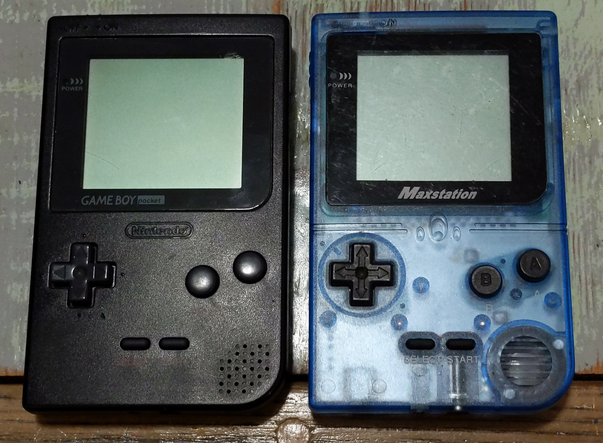

# Overview
The "Maxstation" is a Game Boy clone, seen below next to a Game Boy Pocket.

# Some observed characteristics
* Game Boy Pocket form factor
* DMG-like CPU
* Scrolls a "Loading..." logo on power-up instead of "Nintendo"
* Runs too fast (~19.2% faster), as some other clones do
* Screen has significant motion blur
* Appears to have trouble powering on if connected to another powered-on Game Boy via Link Port
* Cartridge slot does not line up well with the case 

There are markings on the cart slot ("GF Logo") which may link it to "Gang Feng" / "Kong Feng", the makers of the "GB Boy (Pocket)" and "GB Boy Colour" clones.

# Maxstation Boot ROM
The [boot ROM](/bootrom/) was dumped with help from [nitro2k](https://blog.gg8.se/wordpress/) using the BennVenn [clock glitch](https://blog.gg8.se/wordpress/2014/12/09/dumping-the-boot-rom-of-the-gameboy-clone-game-fighter/) method.

The boot ROM is largely identical to the [DMG one](https://gbdev.gg8.se/wiki/articles/Gameboy_Bootstrap_ROM) with a couple differences:
* Loads it's scrolling logo from the bootrom (itself) instead of from the cartridge header region
* Uses different logo data ("Loading...")
* Performs the logo and header checksum calculations, but skips the failure lockup tests

# Pictures

